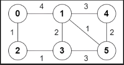
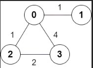

# LeetCode Problems

## Sumário
1. [#1584. Min Cost to Connect All Points](#1584-min-cost-to-connect-all-points-🔶) 

2. [#329. Longest Increasing Path in a Matrix](#329-longest-increasing-path-in-a-matrix-🔴)

3. [#3123. Find Edges in Shortest Paths](#3123-find-edges-in-shortest-paths-🔴)

## #1584. Min Cost to Connect All Points 🔶

You are given an array points representing integer coordinates of some points on a 2D-plane, where points[i] = [xi, yi].

The cost of connecting two points [xi, yi] and [xj, yj] is the manhattan distance between them: |xi - xj| + |yi - yj|, where |val| denotes the absolute value of val.

Return the minimum cost to make all points connected. All points are connected if there is exactly one simple path between any two points.

Example 1:

Input: points = [[0,0],[2,2],[3,10],[5,2],[7,0]]

Output: 20

Explanation:

We can connect the points as shown above to get the minimum cost of 20.
Notice that there is a unique path between every pair of points.

Example 2:

Input: points = [[3,12],[-2,5],[-4,1]]

Output: 18

## Como resolvemos?

Utilizamos o algoritmo de Prim para resolver este problema e criar a árvore geradora mínima, assim retornando o menor custo necessário para conectar todos os pontos.

## #329. Longest Increasing Path in a Matrix 🔴

Given an m x n integers matrix, return the length of the longest increasing path in matrix.

From each cell, you can either move in four directions: left, right, up, or down. You may not move diagonally or move outside the boundary (i.e., wrap-around is not allowed).

Example 1:

Input: matrix = [[9,9,4],[6,6,8],[2,1,1]]

Output: 4

Explanation: The longest increasing path is [1, 2, 6, 9].

Example 2:

Input: matrix = [[3,4,5],[3,2,6],[2,2,1]]

Output: 4

Explanation: The longest increasing path is [3, 4, 5, 6]. Moving diagonally is not allowed.

Example 3:

Input: matrix = [[1]]

Output: 1

## Como resolvemos?
Mesmo não sendo a melhor forma possível, decidimos fazer uma adaptação do Dijkstra, por ser um dos algoritmos vistos nesse módulo.

Enquanto o Dijkstra, mostra o menor caminho entre um ponto e outro, e a cada retirada do heap, atualizávamos com o menor caminho, aqui decidimos que a cada retirada do heap iríamos armazenar em uma matriz auxiliar o maior caminho até aquele nó, claro respeitando a regra de ser sempre um caminho crescente.

Então meio que a ideia veio do Dijkstra, porém não tratamos nosso problema com um grafo com pesos nas arestas, que iam se somando. Aqui o custo pra ir, sempre seria 1, porém era verificado se o vizinho era um número maior que o atual.

## #3123. Find Edges in Shortest Paths 🔴

You are given an undirected weighted graph of n nodes numbered from 0 to n - 1. The graph consists of m edges represented by a 2D array edges, where edges[i] = [ai, bi, wi] indicates that there is an edge between nodes ai and bi with weight wi.

Consider all the shortest paths from node 0 to node n - 1 in the graph. You need to find a boolean array answer where answer[i] is true if the edge edges[i] is part of at least one shortest path. Otherwise, answer[i] is false.

Return the array answer.

Note that the graph may not be connected.

Example 1:

Input: n = 6, edges = [[0,1,4],[0,2,1],[1,3,2],[1,4,3],[1,5,1],[2,3,1],[3,5,3],[4,5,2]]

Output: [true,true,true,false,true,true,true,false]

Explanation: The following are all the shortest paths between nodes 0 and 5:

- The path 0 -> 1 -> 5: The sum of weights is 4 + 1 = 5.
- The path 0 -> 2 -> 3 -> 5: The sum of weights is 1 + 1 + 3 = 5.
- The path 0 -> 2 -> 3 -> 1 -> 5: The sum of weights is 1 + 1 + 2 + 1 = 5.

Example 2:

Input: n = 4, edges = [[2,0,1],[0,1,1],[0,3,4],[3,2,2]]

Output: [true,false,false,true]

Explanation: There is one shortest path between nodes 0 and 3, which is the path 0 -> 2 -> 3 with the sum of weights 1 + 2 = 3.

## Como resolvemos?

Resolvemos utilizar o Dijkstra, para achar o menor caminho do nó 0 até todos os nós, e o mesmo do n - 1 até todos, e também achamos o menor caminho de 0 a n - 1. Uma vez tendo tudo isso, bastou comparar a soma da distância 0 a um nó A, a distância de n - 1 até B e o peso da aresta com o menor caminho de 0 a n - 1, se fosse igual, a aresta fazia parte do caminho.
