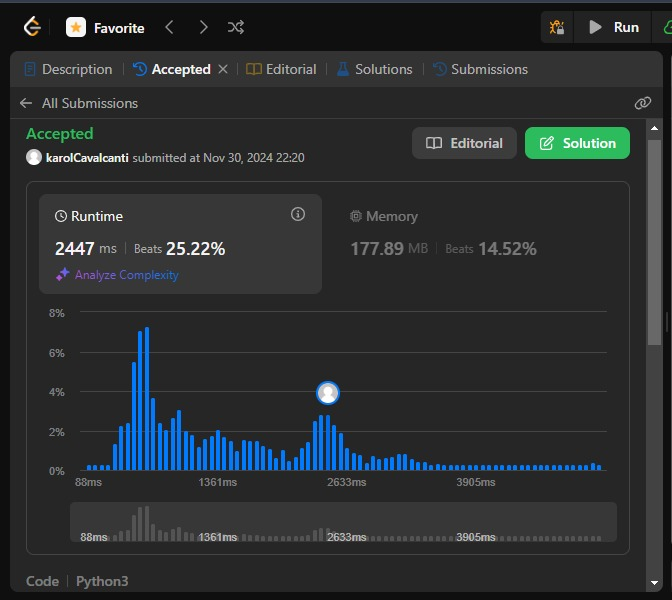
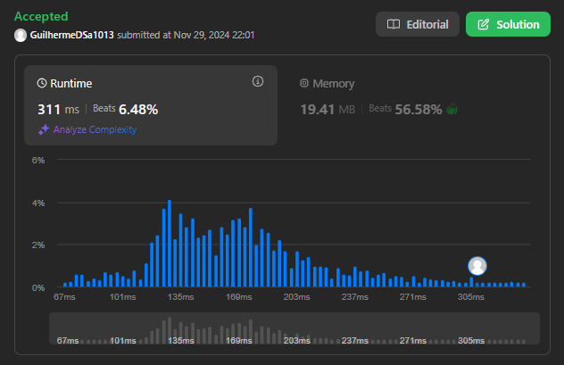
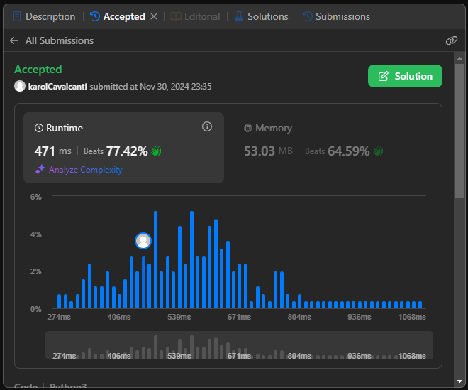

# LeetCode Problems

**Número da Lista**: 26 
**Conteúdo da Disciplina**: Grafos 2 

## Alunos
|Matrícula | Aluno |
| -- | -- |
| 211031575  |  Ana Karoliny de Souza Cavalcanti |
| 211031056  |  Guilherme de Sá Gonçalves |

## Sobre 
Esse projeto tem como objetivo armazenar as resoluções feitas dos seguintes exercícios do LeetCode:

- (Medium) - [#1584. Min Cost to Connect All Points](https://leetcode.com/problems/min-cost-to-connect-all-points/description/?envType=problem-list-v2&envId=agsxfas5)
- (Hard) - [#329. Longest Increasing Path in a Matrix](https://leetcode.com/problems/longest-increasing-path-in-a-matrix/description/?envType=problem-list-v2&envId=agz1mbi2)
- (Hard) - [#3123. Find Edges in Shortest Paths](https://leetcode.com/problems/find-edges-in-shortest-paths/description/)

## Screenshots

#1584. Min Cost to Connect All Points

#329. Longest Increasing Path in a Matrix

#3123. Find Edges in Shortest Paths

## Instalação 
**Linguagem**: Python3 

No caso, basta fazer uma conta no LeetCode, e ir no problema e copiar o código na resolução e testar. 

## Uso 
Porém caso não queira testar pelo LeetCode, basta clonar o repositório e rodar o arquivo com o nome do número do exercício, foram setados os mesmos exemplos de inputs que constam na descrição do problema.

## Outros 
Copiamos os problemas para o repositório, caso não queria abrir o LeetCode e queira ler a descrição do problema, clique [AQUI!!!](Problems.md)

## Vídeos

[Explicação Trabalho (Drive)](https://drive.google.com/file/d/18PWYg50nP_JAD0tUX7MkWeJwnjrKk7mn/view?usp=sharing)

[Explicação Trabalho (YouTube)](https://youtu.be/pWM_7VsPhLs)
